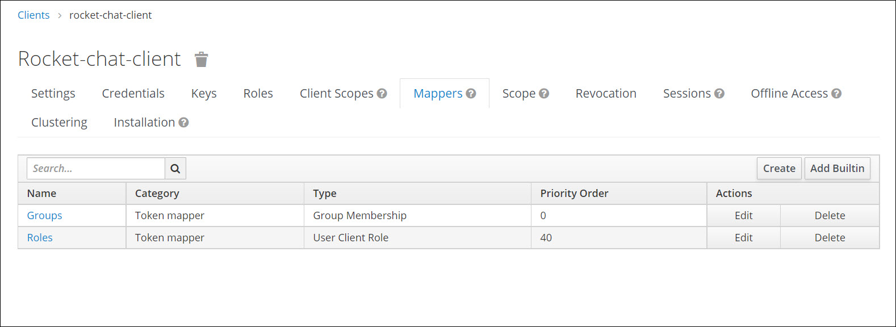

# Keycloak

## Configuring Keycloak OpenID Connect

To create a client in Keycloak,

* Provide a **Client ID**: `rocket-chat-client`
* Select the **Client Protocol** as `openid-connect.`
* Select the **Client access type** as **confidential.**
* Standard flow implemented: **ON**
* Valid Redirect URL: `http:{Rocket.Chat_server_address}/*`


Ensure the Redirect URI is the IP and PORT of your rocket.chat instance.


After saving the changes, a new credentials tab will be created for the client. This credentials tab will provide the client secrets to be used when configuring the Rocket.Chat.

## Configuring Rocket.Chat

### Create a Custom Oauth provider

* Login to Rocket.Chat with an administrator account and navigate to the OAuth page.
* Click the Add custom OAuth button and provide the following configurations.
  * URL: `http://{keycloak_ip_address}:{port}`
  * Token Path: `/realms/{realm_name}/protocol/openid-connect/token`
  * Token sent via: Header
  * Identity Token Sent Via: Same As "Token Sent Via"
  * Identity Path: `/realms/{realm_name}/protocol/openid-connect/userinfo`
  * Authorize Path: `/realms/{realm_name}/protocol/openid-connect/auth`
  * Scope: `openid`
  * Param Name for access token: `access_token`
  * Id: This is the id of the Rocket.Chat client created in the keycloak `rocket-chat-client`
  * Secret: Secret key provided in the credentials tab when creating the Rocket.Chat client
  * Button Text: `Login with Keycloak`


You can also access the URL paths provided in the configurations by navigating to the **Realm setting > General** and clicking the endpoints link. While configuring the settings, replace the `realm_name` with the appropriate realm name. The default realm provided by Keycloak is `master`.


* Leave the rest of the configurations as default. Click S**ave Changes.**
* Enable the new Keycloak provider. Click **Refresh OAuth Services**.
* If you are in a test environment with no SMTP server set, disable Two-factor Authentication in **Administration > Settings > General**.
* A **Login with KeyCloak** button appears on your workspace's login page. Users can now log in with keycloak.

## Mapping non-federated keycloak user roles to Rocket.Chat roles

Client-specific roles of a keycloak managed user can be mapped to Rocket.Chat roles. This does not work for federated users (e.g., LDAP-managed users). For this example, to map the `admin` and `livechat-manager` [role](../../../../use-rocket.chat/workspace-administration/permissions/#roles), add the required roles to the client.

To create a role in KeyCloak,

* Navigate to Roles and click **Add Role.**
* Fill in the name and description of the role, and then click **Save**.
* Add a mapper entry that maps our client roles to OpenId, passing the value to Rocket.Chat.

### **View all client roles**

To view all the client roles you have created,

* Navigate to **Roles** and click **View all roles**

#### **Composite Roles**

A _composite role_ is a role that can be associated with other roles.

To define composite roles,

* Navigate to **Roles > Composite Roles**.

To grant the Rocket.Chat role to a user, we have to modify the users Role Mappings.

**Create Protocol Mapper**

**Mappers**

